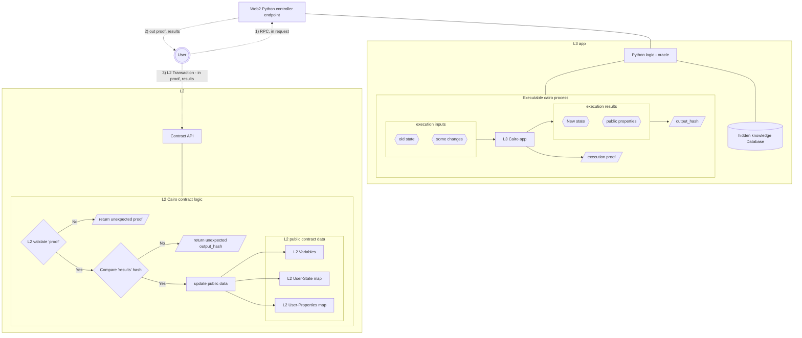

# ShadowGuard
Our aim is to create open-source examples tool-belt for creating and managing secure, privacy-focused L3-ish oracles on StarkNet using Cairo.

## Introductions

Welcome to ShadowGuard, an open-source project dedicated to simplifying the development of privacy-focused, efficient, and secure data management systems using StarkNet and Cairo programming. Our goal is to provide a comprehensive toolkit that includes examples and tools for creating oracles on StarkNet, enabling developers to manage private data off-chain while exposing necessary proofs to the blockchain.

## Use Case Example

### Game Asset Management

Imagine a blockchain-based game where players can own unique items and have specific attributes. Currently, all game data, including ownership and attributes, is public. ShadowGuard enables the game to manage these assets privately off-chain, while only necessary data, like item attributes, are exposed on-chain.

**Example Scenario:**
- A player owns a magical sword, "Excalibur," which gives +3 attack points.
- The ownership of "Excalibur" and its details are managed off-chain (L3) to maintain privacy.
- The attribute "+3 attack points" is exposed on-chain (L2) for gameplay purposes, allowing other players to see this attribute without revealing the entire item details.

## Architecture

### Core Components
1. **L3 Cairo Programs:** Off-chain programs managing private data.
2. **Python Tools:** Facilitate communication between L3 programs and the blockchain.
3. **L2 Verifiers:** Programs that verify the correctness of data sent from L3 to L2.
4. **L2 Contracts:** Smart contracts managing validated facts on-chain.

### Workflow
1. User requests an app to perform an action off-chain.
2. The app initiates L3 actions.
3. Oracle program execution on L3 -> proof generation -> L2 fact check -> Python-controlled callback to off-chain world.
4. Fact proof is visible to the L2 Oracle contract using L2 in-Cairo verifier data.

## Project Status

ShadowGuard is currently in the early development phase. We have completed the initial architectural research, and we are now working on **funding search to cover imlemntation-developmet efforts of Stage 1**. Our focus is on creating a comprehensive library of examples that demonstrate how to create Cairo programs and oracles on StarkNet.

We welcome contributions and feedback from the community to help us refine and expand our toolkit. Stay tuned for updates and join us in making private data management on the blockchain more accessible and efficient!

### Roadmap
 - **Stage 1**: develop core prototype and examples
 - **Stage 2**: research and generalise examples to simplify the creation of new ones using code generation
 - **Stage 3**: look into L3 as a blockchain (e.g. with faster blocks) and L4 for ZKP objects

### Stage 1: Core Prototype and Examples
**Month 1: Initial Setup and Research**
- **Week 1:** Review documentation and analyze the sharp Python code wrapper and Herodotus “integrity” Cairo verifier.
- **Week 2:** Plan system architecture and workflow; set up the development environment.
- **Week 3:** Develop a basic L3 Cairo program for managing private data and document initial findings.
- **Week 4:** Finalize the basic L3 Cairo program and start writing Python code for execution.

**Month 2: Development of Examples and Tools**
- **Week 5:** Develop Python code for proof generation from L3 and begin submission to Herodotus verifier on L2.
- **Week 6:** Complete proof submission and validation with Herodotus; develop a simple L2 Cairo smart contract.
- **Week 7:** Integrate L3 program, Python tools, and L2 contract; start initial testing.
- **Week 8:** Develop a demo client to showcase the system and integrate components.

**Month 3: Integration, Testing, and Early Community Engagement**
- **Week 9:** Continue developing and integrating the demo client; conduct initial testing.
- **Week 10:** Debug and perform thorough testing and validation.
- **Week 11:** Optimize system performance; begin early community engagement and gather feedback.
- **Week 12:** Prepare initial documentation and iterate based on feedback.

**Month 4: Finalization, Documentation, and Deployment**
- **Week 13:** Final testing and optimization; finalize documentation and tutorials.
- **Week 14:** Ensure the demo client is user-friendly; plan deployment strategy and marketing efforts.
- **Week 15:** Deploy the final project version; announce release and support early adopters.
- **Week 16:** Continue community engagement for further improvements and gather ongoing feedback.

### Summary of Deliverables
- **Month 1:** Research, project planning, and initial L3 Cairo program development.
- **Month 2:** Completion of L3 Cairo program, Python integration for execution and proof generation, and simple L2 proof validation.
- **Month 3:** Comprehensive integration and testing, development of demo client, early community engagement, and initial documentation.
- **Month 4:** Finalization based on feedback, comprehensive documentation, final testing, optimization, and deployment.

---

### Reading Materials:
- **Docs:** 
  - [Herodotus Integrity](https://github.com/HerodotusDev/integrity)
  - [StarkNet SHARP](https://docs.cairo-lang.org/sharp.html)
  - [Sharp Client Test](https://github.com/starkware-libs/cairo-lang/blob/master/src/starkware/cairo/sharp/sharp_client_test.py)
  - [StarkNet Sequencers](https://book.starknet.io/ch03-02-sequencers.html)
  - [Recursive Proofs in SHARP](https://book.starknet.io/ch03-03-provers.html#recursive-proofs-in-sharp)
  
- **Videos:**
  - [StarkNet Introduction](https://www.youtube.com/watch?v=01tIeGBHsek)
  - [Deep Dive into StarkNet](https://www.youtube.com/watch?v=pu14ktWWfh0)

Join us in building the future of private data management on the blockchain with ShadowGuard!
